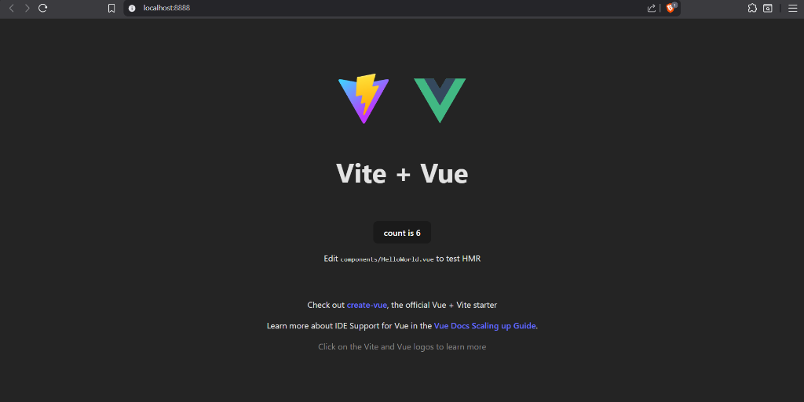
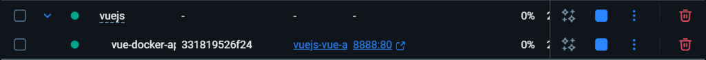

# Vue.js Dockerized Application

This is a Vue 3 application built with Vite and containerized using Docker for easy deployment and development.



## 🚀 Getting Started

### Prerequisites

- [Docker](https://www.docker.com/products/docker-desktop) installed on your machine.
- [Node.js](https://nodejs.org/) (optional, only for local non-Docker development).

---

## 🐳 Docker Setup (Recommended)

This project includes a fully configured Docker setup with Nginx serving the production build.

### 1. Build and Run

To start the application in a container:

```bash
docker-compose up -d --build
```

This command will:
1.  Build the Vue.js application (using a multi-stage build).
2.  Start an Nginx server to serve the static files.
3.  Expose the application on port **8888** (as configured in `docker-compose.yml`).



### 2. Access the Application

Open your browser and navigate to:

[http://localhost:8888](http://localhost:8888)


### 3. Stop the Application

To stop the running containers:

```bash
docker-compose down
```

---

## 💻 Local Developement

If you prefer to run the application locally without Docker (e.g., for hot-reload during active development):

### 1. Install Dependencies

```bash
npm install
```

### 2. Run Development Server

```bash
npm run dev
```

The application will usually be available at `http://localhost:5173` (Vite's default port).

### 3. Build for Production

To create a production build locally:

```bash
npm run build
```

The output files will be in the `dist/` directory.

---

## 📂 Project Structure

- **`Dockerfile`**: Multi-stage Docker configuration (Build + Nginx).
- **`docker-compose.yml`**: Orchestration file defining the service and ports.
- **`nginx.conf`**: Nginx configuration file for handling SPA routing.
- **`src/`**: Vue.js source code.
- **`public/`**: Static assets.
